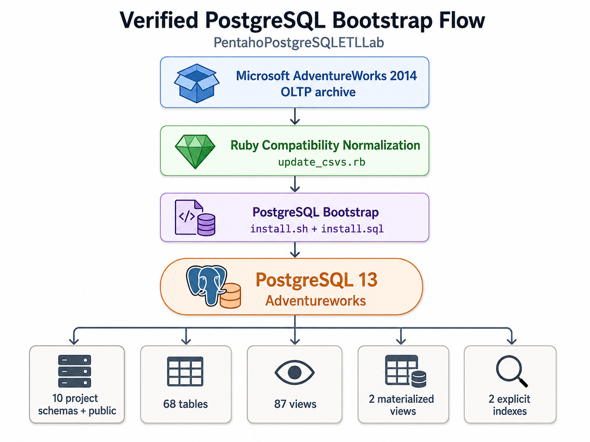
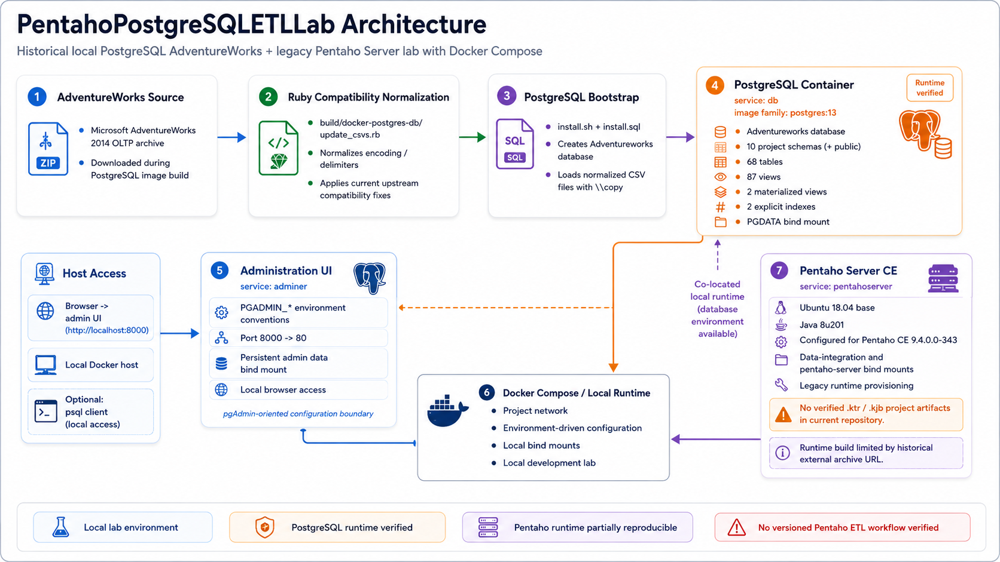

<h1 align="left">PentahoPostgreSQLETLLab</h1>

<p align="center">
  <strong>Reproducible PostgreSQL AdventureWorks bootstrap and legacy Pentaho Server lab</strong>
</p>

<p align="left">
  
  
  
  
  
  
  
</p>

Historical/local data-platform lab that assembles a PostgreSQL AdventureWorks environment, a pgAdmin-oriented administration service, and a legacy Pentaho Server runtime through Docker Compose.

> **Evidence boundary:** the current repository does **not** contain project-specific Pentaho Data Integration transformation (`.ktr`) or job (`.kjb`) files. The repository therefore demonstrates a reproducible PostgreSQL bootstrap/data-loading flow and a local multi-service platform environment, but it must not be presented as a verified end-to-end Pentaho ETL pipeline unless the original PDI artifacts are recovered and audited.

## Overview

The repository combines three concerns:

1. **AdventureWorks on PostgreSQL** — a Dockerized bootstrap derived from the upstream `lorint/AdventureWorks-for-Postgres` project.
2. **Database administration** — a Compose service configured with `PGADMIN_*` environment conventions and persistent local data.
3. **Pentaho Server** — a legacy container build configured for Pentaho Server CE `9.4.0.0-343` on Ubuntu 18.04 with Java 8u201.

The verified PostgreSQL bootstrap flow is illustrated below:

<p align="center">
  
</p>

Pentaho Server is provisioned alongside the database environment, but no versioned project transformation/job currently proves a Pentaho-to-PostgreSQL ETL workflow.

## Architecture

<p align="center">
  
</p>

The architecture separates two evidence levels:

- the **PostgreSQL bootstrap path** is runtime verified;
- the **Pentaho Server path** is a legacy co-located runtime whose build is only partially reproducible because one historical external archive URL is no longer directly retrievable.

The administration service is documented as **pgAdmin-oriented** because its public configuration uses `PGADMIN_*` variables and a dedicated admin-data mount, while the concrete image name remains environment-driven through `.env`.

## Historical context

The Git history requires special interpretation. The current branch contains inherited history from `AdventureWorks-for-Postgres`, followed by a 2026 repository integration commit. Earlier commits therefore describe upstream development and must not be treated as contributions by the PentahoPostgreSQLETLLab project team.

The project-specific historical period before the 2026 repository integration is **not established by the current Git evidence**. If original local `.ktr`, `.kjb`, screenshots, reports, assignment material, or dated archives are recovered, they should be audited separately before assigning an earlier project period.

## Team and contribution boundary

### Team context

The repository contains substantial third-party work. The inherited AdventureWorks PostgreSQL history includes upstream contributors, while the Pentaho Server build directory contains third-party source and binary artifacts with separate attribution/licensing boundaries.

### My contribution

The currently verifiable repository-specific contribution is the 2026 integration and remediation layer that assembles the local Docker environment around PostgreSQL, pgAdmin-oriented configuration, and Pentaho Server, and hardens its reproducibility, documentation, and publication boundaries.

This README intentionally does not claim authorship of the upstream AdventureWorks implementation, Pentaho Server container source, bundled plugins, or other third-party artifacts.

### Evidence limitations

Git commit counts are not used as a proxy for contribution importance. Upstream Git identities and third-party source authors are treated separately from the repository owner's integration work.

## What this project demonstrates

With the current evidence, the repository demonstrates:

- local data-service composition with Docker Compose;
- PostgreSQL 13 bootstrap and initialization from the AdventureWorks 2014 sample data;
- Ruby-based source compatibility normalization before database loading;
- relational schema initialization with tables, views, materialized views, constraints, extensions, and explicit indexes;
- verified PostgreSQL build, initialization, data population, and relational-object creation;
- provisioning of a legacy Pentaho Server runtime alongside PostgreSQL;
- externalized local credentials through `.env` / `.env.example` conventions;
- conservative third-party provenance and licensing boundaries.

It does **not** demonstrate a versioned Pentaho transformation/job workflow.

## ETL / bootstrap workflow

### Extract

The PostgreSQL image build downloads the Microsoft AdventureWorks 2014 OLTP install archive from the `sql-server-samples` release location.

### Transform

`build/docker-postgres-db/update_csvs.rb` performs source compatibility normalization before PostgreSQL ingestion.

During the 2026 remediation, the vendored `update_csvs.rb` and `install.sql` were synchronized byte-for-byte with the current upstream `AdventureWorks-for-Postgres` state after verifying that the repository copies matched historical upstream commit `b37c060`.

Relevant upstream compatibility commits:

- `9bbff2c` — `Adopt to changed file encodings in Microsoft download`
- `9e9d2a7` — follow-up parser/import fixes
- `b474991` — upstream merge containing those fixes

The updated normalization handles the current downloaded file format, including UTF-8 processing, `+|` / `&|` record handling, selected NUL cleanup, and compatibility escaping required by PostgreSQL imports.

### Load

`build/docker-postgres-db/install.sh` creates the `Adventureworks` database and executes `install.sql`. The SQL script creates the relational model and imports normalized source files using `\copy`.

### Pentaho boundary

No `.ktr` or `.kjb` file is versioned in the current repository. Therefore the verified Extract/Transform/Load sequence above is a **database bootstrap flow implemented by Docker, Ruby, shell, and SQL**, not a verified Pentaho Data Integration pipeline.

## Pentaho transformations/jobs

Current repository inventory:

- `.ktr` transformations: **0 verified**
- `.kjb` jobs: **0 verified**
- `data/pentaho/data-integration/`: placeholder only (`.gitkeep`)
- `data/pentaho/pentaho-server/`: placeholder only (`.gitkeep`)

The Pentaho Server configuration recognizes `.ktr` and `.kjb`, which demonstrates platform capability but does not prove a project-specific workflow.

## PostgreSQL role

The Compose build targets the PostgreSQL `13` image family and initializes the `Adventureworks` database.

Static and runtime validation are consistent:

- **10 project schemas** plus PostgreSQL `public`;
- **68 tables**;
- **87 regular views**;
- **2 materialized views**;
- **2 explicit indexes**;
- `uuid-ossp` and `tablefunc` extensions;
- primary/foreign-key and check-constraint definitions.

Runtime-verified representative row counts:

```text
person.person|19972
production.product|504
purchasing.purchaseorderheader|4012
sales.salesorderheader|31465
```

Verified explicit indexes:

```text
person.ix_vstateprovincecountryregion
production.ix_vproductanddescription
```

A fresh isolated PostgreSQL validation environment completed initialization successfully after the upstream compatibility fixes were synchronized.

## Data model

The database is the AdventureWorks sample relational model representing a fictitious bicycle business. The upstream PostgreSQL port organizes HR, person, production, purchasing, and sales data across its principal schemas.

The model and conversion/bootstrap work are attributed to their upstream sources rather than presented as original project design.

## Data sources and provenance

### AdventureWorks sample data

- Source family: Microsoft AdventureWorks sample database.
- Dataset/version used by the Docker build: AdventureWorks 2014 OLTP install archive.
- Repository presence: the archive is downloaded during image build; generated CSV files are not intended to be committed.
- Ownership boundary: the repository does not claim ownership of the Microsoft sample dataset.

### AdventureWorks-for-Postgres

The PostgreSQL conversion/bootstrap is derived from `lorint/AdventureWorks-for-Postgres` and retains its MIT license material inside `build/docker-postgres-db/`.

The 2026 compatibility remediation follows upstream fixes rather than introducing an independent fork of the CSV parser behavior.

### Docker Pentaho Server material

`build/docker-pentaho-server/README.md` attributes the inherited container project to Mariano Alberto García Mattío and states Apache License 2.0 for that material.

Bundled third-party artifacts are treated separately:

- **Pivot4J Pentaho plugin** — identity verified; project-level licensing evidence exists, while exhaustive bundled dependency/license accounting was not reconstructed.
- **JSF API 1.1_02** — identity and Sun Microsystems vendor metadata verified from its embedded manifest.
- **Datafor plugin bundle** — identity and integration context verified, but the license and redistribution rights for the complete bundled ZIP remain **unresolved**.

No blanket project license is asserted over these third-party artifacts.

## Reproducibility

### Current status

**PostgreSQL runtime verified / Pentaho runtime partially reproducible.**

Verified during the 2026 audit:

- `docker compose config --quiet` succeeds with a populated local `.env`;
- the PostgreSQL image builds successfully;
- a fresh isolated PostgreSQL instance initializes successfully;
- the `Adventureworks` database is created;
- representative tables are populated;
- runtime schemas/tables/views/materialized views reconcile with static analysis;
- both explicit indexes are present;
- the corrected admin-data persistence target uses `${pgadmin_data}`;
- the Pentaho build resolves Ubuntu 18.04 and Java 8u201 but stops when retrieving the historical Pentaho Server CE `9.4.0.0-343` archive because the external URL no longer provides the expected downloadable artifact.

The Pentaho limitation is therefore classified as a **legacy external dependency availability issue**, not as a verified application/runtime failure after successful server startup.

### Administration service boundary

The Compose service is named `adminer`, uses image tag `:7`, and receives `PGADMIN_DEFAULT_EMAIL` / `PGADMIN_DEFAULT_PASSWORD`.

Because the image repository itself is supplied through `${image_name_admin}` in the local `.env`, the public repository does not independently fix a concrete pgAdmin image identity. The README therefore describes this component conservatively as a **pgAdmin-oriented administration service**.

## Local setup

1. Copy `.env.example` to `.env`.
2. Populate local values only; never commit `.env`.
3. Run the static/security validation checks before starting containers.
4. Validate Compose configuration.
5. Build or start only the services required for the intended local test.

```bash
cp .env.example .env
docker compose config
```

### PostgreSQL

```bash
docker compose build db
docker compose up -d db
```

### Full local composition

```bash
docker compose build db pentahoserver
docker compose up -d db adminer pentahoserver
```

> The Pentaho Server build currently depends on a historical external archive URL that was not retrievable during the 2026 validation. PostgreSQL can be validated independently.

## Environment variables

The tracked `.env.example` declares variables for:

- PostgreSQL container/image/build/password/data paths;
- pgAdmin-oriented administration container/image/default credentials/data paths;
- Pentaho container/build/user/password.

The actual local `.env` is ignored by Git and must not be committed.

## Validation

The remediation workflow separates validation into:

- static repository/XML/SQL checks;
- Git contributor/history inventory;
- current-tree secret scanning;
- history-aware sensitive-keyword review;
- Pentaho connection/credential-field scanning;
- provenance/licensing review;
- Docker/Compose configuration checks;
- PostgreSQL runtime verification;
- documentation and post-commit boundary checks.

### PostgreSQL runtime result

**PASS**

The fresh isolated runtime verified:

```text
Adventureworks database: present

Schemas:              10 project schemas + public
Tables:               68
Regular views:        87
Materialized views:   2
Explicit indexes:     2
```

The only `FATAL` observed in the validation container logs was `role "root" does not exist`, generated by an external `pg_isready` invocation that omitted `-U postgres`; it was not an initialization or data-load failure.

### Pentaho runtime result

**PARTIAL / legacy dependency limitation**

The container build reached the Pentaho Server CE archive retrieval step after successfully resolving the Ubuntu 18.04 base and Java 8u201 dependency. The historical Pentaho archive URL returned a redirect without a usable artifact, preventing completion of the build.

No modernization or replacement Pentaho distribution was introduced because doing so would change the historical environment being audited.

## Limitations

- No project-specific `.ktr` or `.kjb` is versioned.
- Project-specific historical dates before the 2026 integration commit are not established by current Git evidence.
- The Pentaho Server image is not fully reproducible while its historical external archive URL remains unavailable.
- The administration service image repository is environment-driven, so public evidence supports a pgAdmin-oriented configuration boundary rather than a fixed image identity.
- `datafor.zip.1` remains a third-party artifact with **unresolved license/redistribution rights**.
- Pivot4J bundled dependency/license accounting is only partially resolved.
- A project-level root license is not currently established; subcomponents retain their own attribution/license boundaries.
- A verified Pentaho-to-PostgreSQL ETL workflow cannot be claimed without recovered and audited PDI artifacts.

## Security / publication notes

- `.env` is ignored by Git and Docker context rules.
- `.env.example` provides configuration variable names without serving as a real credential file.
- Current-tree scanning found no credential evidence requiring remediation; low-severity IPv4 findings were configuration/network addresses.
- Pentaho-sensitive connection scanning found no `.ktr` / `.kjb` credential artifacts because no such project files are present.
- History-aware sensitive-keyword review identified variable/schema identifiers rather than verified secrets.
- Raw logs containing AdventureWorks row data are not intended as publication evidence; runtime results should be recorded in sanitized summaries.
- Third-party artifacts retain independent ownership/licensing boundaries.
- Publication safety remains conservative while the complete Datafor ZIP redistribution boundary is unresolved.

## 2026 portfolio refresh

The 2026 refresh is presented as **repository integration, reproducibility, security, provenance, and documentation remediation**, separate from any earlier historical lab work that may later be recovered.

The strongest defensible evidence is the verified PostgreSQL bootstrap plus the careful preservation and documentation of the legacy Pentaho environment and its limitations.

## Builder Journey

```text
relational database environments
        ->
local data-service composition and bootstrap
        ->
reproducibility and provenance hardening
        ->
data/platform engineering foundations
```

Positioning this repository specifically as a Pentaho ETL milestone would require recovered and audited PDI transformation/job artifacts.

## License

No new project-level license is asserted by this README.

Third-party subcomponents retain their own attribution and licensing boundaries. In particular, the complete `datafor.zip.1` redistribution license remains unresolved, so a root license must not be interpreted as blanket relicensing of bundled third-party material.
